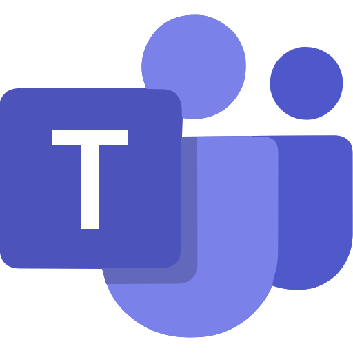
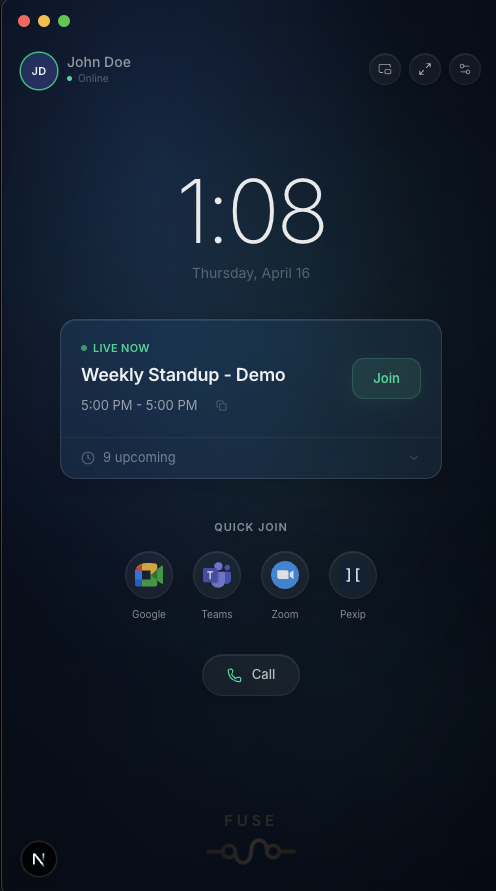
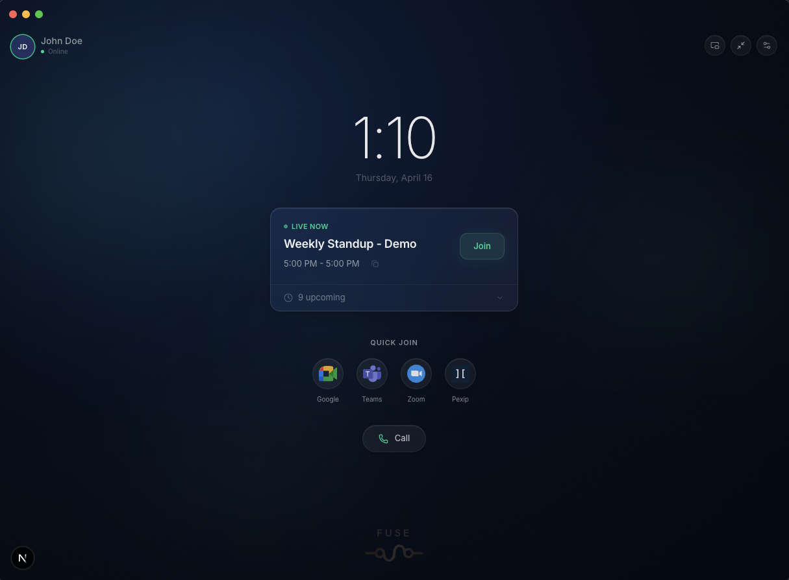
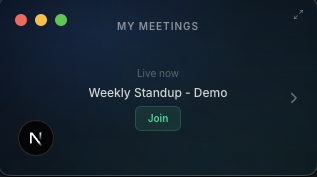
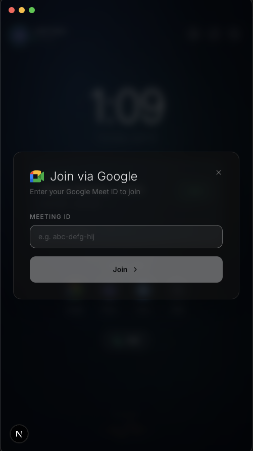
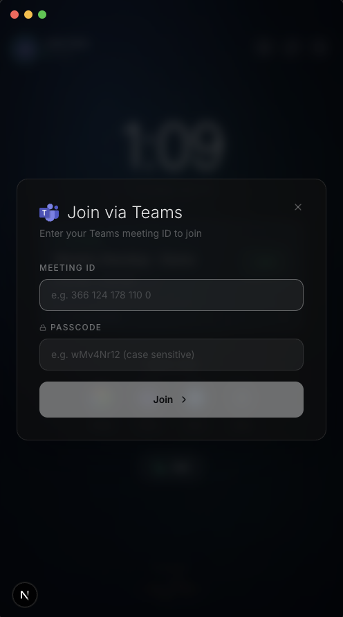
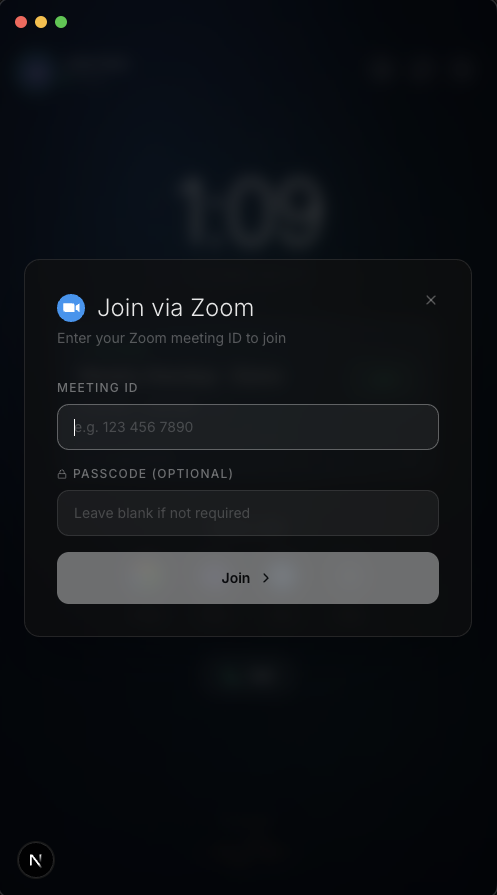
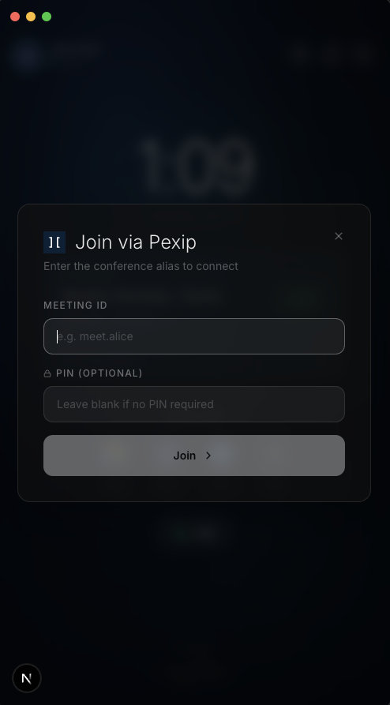

<p align="center">
  
</p>

<h1 align="center">Fuse Video Client</h1>

<p align="center">
  A native Electron video conferencing client that joins Pexip, Zoom, Google Meet, and Microsoft Teams meetings through a single interface. Built on <a href="https://www.pexip.com/">Pexip Infinity's</a> PexRTC client APIs with offline live transcription powered by NVIDIA's Parakeet speech model via Sherpa-ONNX.
</p>

<p align="center">
  
  
  
  
  
</p>

<p align="center">
  <strong>One client for every meeting.</strong> Join any provider with a single click.
</p>

<p align="center">
     
     
     
  
</p>

<br/>

<p align="center">
  <strong>Compact</strong>                                                                                                                <strong>Expanded</strong>
</p>
<p align="center">
     
  
</p>

<br/>

<p align="center"><strong>Mini Mode</strong></p>
<p align="center">
  
</p>

<br/>

<p align="center"><strong>Quick Join</strong></p>
<p align="center">
   
   
   
  
</p>
<p align="center">
  <em>Google Meet                           Teams                           Zoom                         Pexip</em>
</p>

---

## Key Features

- **One-Touch Multi-Provider Joining** -- Join Zoom, Google Meet, Microsoft Teams, and Pexip meetings from a single interface via Pexip CVI gateway routing
- **Calendar Integration** -- One Touch Join calendar pulls upcoming meetings with auto-detected provider icons and one-click joining
- **Local Transcription** -- Offline speech-to-text powered by NVIDIA's Parakeet TDT-CTC 110M model running locally via Sherpa-ONNX (Electron only, no cloud dependency). Also supports remote WebSocket transcription services.
- **Registered WebRTC Client** -- Register as a Pexip WebRTC device to receive incoming calls with configurable ringtones
- **3 Window Modes** -- Compact (500x900), expanded (1220x900), and mini (320x180) floating PiP
- **Setup Wizard** -- Guided first-launch onboarding: connection, registration, calendar, providers, devices, transcription model download, and system checks
- **Quick Join Toggles** -- Enable/disable provider buttons per your configured infrastructure

---

## Table of Contents

- [Tech Stack](#tech-stack)
- [Prerequisites](#prerequisites)
- [Getting Started](#getting-started)
- [Configuration](#configuration)
- [How It Works](#how-it-works)
- [Environment Variables](#environment-variables)
- [Available Scripts](#available-scripts)
- [Electron Desktop App](#electron-desktop-app)
- [Testing](#testing)
- [Troubleshooting](#troubleshooting)
- [Roadmap](#roadmap)

---

## Tech Stack

| Layer          | Technology                                                            |
| -------------- | --------------------------------------------------------------------- |
| **Framework**  | Next.js 16 (App Router, standalone output)                            |
| **Language**   | TypeScript 5 (strict mode)                                            |
| **UI**         | React 19, Tailwind CSS v4, Framer Motion                              |
| **Components** | Radix UI primitives, Lucide React icons, Sonner toasts                |
| **WebRTC**     | PexRTC (Pexip Infinity browser SDK, loaded dynamically from node)     |
| **Desktop**    | Electron 35 with context isolation                                    |
| **Speech**     | NVIDIA Parakeet TDT-CTC 110M via Sherpa-ONNX (offline, Electron-only) |
| **Testing**    | Vitest 4, Testing Library, jsdom                                      |
| **Linting**    | ESLint 9, Prettier                                                    |

---

## Prerequisites

- **Node.js** 20+
- **npm** (ships with Node.js)
- A **Pexip Infinity** deployment (node domain) -- the app cannot function without one
- _(Optional)_ Pexip OTJ portal credentials for calendar integration
- _(Optional)_ Xcode Command Line Tools for Electron macOS builds

> **Note**: All provider features (Zoom, Teams, Google Meet quick join) route through your Pexip node via CVI. Without a Pexip deployment and properly configured call routing rules, calls will not connect.

---

## Getting Started

### 1. Clone and Install

```bash
git clone https://github.com/Josh-E-S/fuse-video-client.git
cd fuse-video-client
npm install
```

### 2. Environment Setup

```bash
cp .env.example .env.local
```

For basic usage, no `.env.local` values are strictly required -- configure everything through the in-app Settings modal or Setup Wizard. See [Environment Variables](#environment-variables) for the full reference.

### 3. Start Development

**Browser mode:**

```bash
npm run dev
```

Open [http://localhost:3002](http://localhost:3002).

**Electron mode:**

```bash
npm run dev          # Terminal 1: Next.js dev server
npm run electron:dev # Terminal 2: Electron shell
```

### 4. First Launch

The Setup Wizard walks you through:

1. **Connection** -- Pexip node domain and display name
2. **Registration** -- WebRTC device alias, username, and password for incoming calls
3. **Calendar** -- OTJ client credentials for meeting discovery
4. **Providers** -- Google Meet domain and Pexip customer ID for Teams CVI
5. **Devices** -- Camera, microphone, and speaker selection with live preview
6. **Transcription** -- Download the speech model for offline captions (Electron only, ~126 MB)
7. **System Check** -- Validates node reachability, registration, calendar auth, devices, and model status

All settings can be changed later via the gear icon in the top bar.

---

## Configuration

### In-App Settings

All configuration persists in `localStorage` and syncs across windows:

| Setting                | Purpose                                                    |
| ---------------------- | ---------------------------------------------------------- |
| **Node Domain**        | Your Pexip Infinity node (e.g.`pexip.example.com`)         |
| **Display Name**       | Name shown to other participants                           |
| **Registration**       | WebRTC device alias, username, password for incoming calls |
| **Audio Input/Output** | Microphone and speaker selection                           |
| **Video Input**        | Camera selection                                           |
| **Ringtone**           | Incoming call sound (8 options)                            |
| **OTJ Credentials**    | Client ID/Secret for calendar integration                  |
| **Customer ID**        | Required for Microsoft Teams CVI dial strings              |
| **Google Domain**      | Required for Google Meet CVI dial strings                  |
| **Quick Join Toggles** | Show/hide provider buttons on the home screen              |
| **Theme**              | 10 visual themes across 4 categories                       |

### Dial String Builders

Fuse constructs provider-specific dial strings automatically. All calls route through your Pexip node:

| Provider            | Dial String Format                              | Config Required           |
| ------------------- | ----------------------------------------------- | ------------------------- |
| **Pexip**           | Alias passthrough                               | Node domain               |
| **Zoom**            | `meetingId.passcode@zoomcrc.com`                | Node domain               |
| **Google Meet**     | `meetingId@GOOGLE_DOMAIN`                       | Google domain             |
| **Microsoft Teams** | `meetingId.encodedPasscode..CUSTOMER_ID@pex.ms` | Customer ID (server-side) |
| **Generic**         | Alias passthrough                               | Node domain               |

> Quick Join buttons are automatically hidden when their required configuration is missing. You can also toggle them manually in Settings > Meetings > Quick Join.

---

## How It Works

### Meeting Join Flow


### State Architecture

| Layer                  | Mechanism           | Scope                                                 |
| ---------------------- | ------------------- | ----------------------------------------------------- |
| **Conference**         | PexipContext        | WebRTC connection, streams, participants, chat        |
| **Registration**       | RegistrationContext | WebRTC device registration, incoming calls, heartbeat |
| **Picture-in-Picture** | PipContext          | documentPictureInPicture API                          |
| **Settings**           | useSettings hook    | localStorage with cross-instance sync                 |
| **Theme**              | useTheme hook       | CSS custom properties, no flash on load               |
| **Quick Join**         | useQuickJoin hook   | Provider toggle state with cross-instance sync        |

### Key Services

| Service                   | Role                                                                                     |
| ------------------------- | ---------------------------------------------------------------------------------------- |
| `pexrtcLoader`            | Dynamically loads PexRTC.js from the Pexip node with retry logic                         |
| `pexrtcConnectionManager` | Singleton managing the full conference lifecycle (connect, PIN, mute, share, disconnect) |
| `pexipOTJ`                | OAuth + REST client for the Pexip One Touch Join calendar API                            |

### Architecture Diagrams

<details>
<summary>Connection Flow</summary>


</details>

### Directory Structure

```
src/
├── app/                          # Next.js App Router
│   ├── api/                      # Server-side API routes
│   │   ├── meetings/             # OTJ calendar proxy
│   │   └── dial-string/teams/    # Teams CVI dial string builder
│   ├── meeting/[alias]/          # In-call meeting page
│   ├── presentation-popout/      # Second window for content sharing
│   └── page.tsx                  # Home page
├── components/
│   ├── home/                     # Landing page (clock, calendar, quick join)
│   ├── modals/                   # Dialogs (join, preflight, settings, wizard, DTMF, stats)
│   └── resync/                   # In-call UI (controls, chat, transcript, participants, dock)
├── contexts/                     # React Context providers
├── hooks/                        # Custom hooks (settings, devices, theme, transcription, etc.)
├── services/                     # PexRTC loader, connection manager, OTJ client
├── themes/                       # 10 theme definitions with CosmeticTheme interface
├── types/                        # PexRTC and meeting TypeScript types
└── utils/                        # Media, date, provider detection helpers

electron/
├── main.js                       # Window management, IPC, permissions, splash screen
├── preload.js                    # Context-isolated bridge (expand, mini, transcription, models)
├── transcription.js              # Sherpa-ONNX speech recognition + model management
└── splash.html                   # Loading screen with logo
```

---

## Environment Variables

Copy `.env.example` to `.env.local`. All values are optional -- settings can be configured through the UI.

### Server-Side (API routes only)

| Variable                  | Description                                                |
| ------------------------- | ---------------------------------------------------------- |
| `PEXIP_OTJ_AUTH_URL`      | Pexip OAuth endpoint (default:`https://auth.otj.pexip.io`) |
| `PEXIP_OTJ_API_URL`       | Pexip OTJ API endpoint (default:`https://otj.pexip.io`)    |
| `PEXIP_OTJ_CLIENT_ID`     | OTJ OAuth client ID                                        |
| `PEXIP_OTJ_CLIENT_SECRET` | OTJ OAuth client secret                                    |
| `PEXIP_CUSTOMER_ID`       | Pexip customer ID for Teams CVI                            |

### Client-Side

| Variable                            | Description                                     |
| ----------------------------------- | ----------------------------------------------- |
| `NEXT_PUBLIC_GOOGLE_DOMAIN`         | Google Meet CVI gateway domain                  |
| `NEXT_PUBLIC_TEAMS_DOMAIN`          | Teams CVI gateway domain (provider detection)   |
| `NEXT_PUBLIC_PEXIP_DOMAIN`          | Pexip tenant domain suffix (provider detection) |
| `NEXT_PUBLIC_TRANSCRIPTION_API_URL` | WebSocket transcription service URL             |

### Dev Defaults (optional, pre-populate Settings on first launch)

| Variable                           | Description                   |
| ---------------------------------- | ----------------------------- |
| `NEXT_PUBLIC_DEFAULT_NODE_DOMAIN`  | Default Pexip node domain     |
| `NEXT_PUBLIC_DEFAULT_DISPLAY_NAME` | Default display name          |
| `NEXT_PUBLIC_DEFAULT_ALIAS`        | Default registration alias    |
| `NEXT_PUBLIC_DEFAULT_REG_USERNAME` | Default registration username |
| `NEXT_PUBLIC_DEFAULT_REG_PASSWORD` | Default registration password |

> OTJ credentials can also be provided per-user through the Settings modal, which passes them as headers to the API route.

---

## Available Scripts

| Command                   | Description                                      |
| ------------------------- | ------------------------------------------------ |
| `npm run dev`             | Start Next.js dev server on port 3002            |
| `npm run build`           | Production build (standalone output)             |
| `npm start`               | Start production server                          |
| `npm run lint`            | Run ESLint                                       |
| `npm test`                | Run Vitest test suite                            |
| `npm run test:watch`      | Run tests in watch mode                          |
| `npm run format`          | Format code with Prettier                        |
| `npm run format:check`    | Check formatting without writing                 |
| `npm run electron:dev`    | Launch Electron in development mode              |
| `npm run electron:build`  | Build Next.js + package as signed `.dmg`         |
| `npm run electron:pack`   | Build + package Electron (unpacked, for testing) |
| `npm run download-models` | Download Sherpa-ONNX Parakeet model (~126 MB)    |

---

## Electron Desktop App

### Window Modes

| Mode         | Size       | Use Case                                                  |
| ------------ | ---------- | --------------------------------------------------------- |
| **Compact**  | 500 x 900  | Default home view                                         |
| **Expanded** | 1220 x 900 | In-call with side panels (chat, transcript, participants) |
| **Mini**     | 320 x 180  | Floating PiP centered under webcam                        |

Mini mode joins calls fully muted with no preflight. It shows far-side video with a 64x48 self-view overlay and minimal controls.

### Building for macOS

```bash
npm run electron:build
```

Produces a code-signed `.dmg` in `dist-electron/`. Includes:

- macOS entitlements for camera, microphone, and screen capture
- Dark mode support
- Splash screen with logo while Next.js cold-starts

### Local Transcription

Fuse runs NVIDIA's Parakeet TDT-CTC 110M speech model locally via Sherpa-ONNX -- no cloud transcription service required. The model (~126 MB) can be downloaded from:

1. **Setup Wizard** -- Transcription step during first launch
2. **Settings** -- Devices tab > Live Transcription
3. **Terminal** -- `npm run download-models`

Models are stored in `~/Library/Application Support/Fuse Video Client/models/` and persist across app updates.

---

## Testing

```bash
npm test              # Run all tests
npm run test:watch    # Watch mode
```

Tests use **Vitest** with **Testing Library** and **jsdom**:

```
src/__tests__/
├── utils/
│   ├── meetingProvider.test.ts   # Provider detection from aliases
│   ├── meetingDate.test.ts       # Date formatting helpers
│   ├── stateTheme.test.ts        # Theme state utilities
│   └── media.test.ts             # Media helper functions
└── hooks/
    └── useElectron.test.ts       # Electron bridge detection
```

---

## Troubleshooting

### Cannot connect to node

1. Verify your Pexip node domain is correct in Settings
2. Test reachability: open `https://<node>/api/client/v2/status` in a browser
3. Check for CORS issues if running on a different origin

### Camera or microphone not working

1. Check browser permissions (camera icon in address bar)
2. macOS: System Settings > Privacy & Security > Camera/Microphone
3. Electron: permissions are requested on first use -- restart if denied

### Quick Join calls fail

1. Ensure call routing rules are configured on your Pexip Infinity deployment
2. Verify the required provider config is set (Google domain, customer ID)
3. Check that CVI licenses are active on your Pexip node

### Calendar shows "Calendar not configured"

1. Add OTJ credentials in Settings > Meetings or the Setup Wizard
2. Verify the OTJ portal has calendar sources configured
3. Check browser console for errors from `/api/meetings`

### Electron shows blank screen

1. Ensure the Next.js dev server is running first (`npm run dev`)
2. Electron connects to `localhost:3002` in development mode
3. DevTools opens automatically in dev -- check for errors

### Transcription not appearing

- **Live mode**: Requires a WebSocket transcription service at `NEXT_PUBLIC_TRANSCRIPTION_API_URL`
- **Local mode**: Requires Electron + downloaded model (check Settings > Devices > Live Transcription)
- If the model shows "Ready" but captions are empty, check the Electron main process console for decode errors

---

## Roadmap

- [ ] **Sandbox mode** -- enable Electron's OS-level sandbox for renderer hardening
- [ ] **Content Security Policy** -- configure CSP headers on all windows
- [ ] **Navigation guards** -- intercept `will-navigate` to block unexpected URLs
- [ ] **Auto-update** -- ship updates via `electron-updater` with GitHub Releases
- [ ] **Notarization** -- macOS notarization for Gatekeeper-trusted distribution
- [ ] **Supabase integration** -- cloud-synced settings, call history, and user profiles
- [ ] **QR provisioning** -- scan a QR code to configure node domain and credentials
- [ ] **Email discovery** -- auto-detect Pexip node from user email domain

---

## License

MIT. See [LICENSE](LICENSE) for details.

Fuse Video Client is an independent open-source project and is not officially affiliated with or endorsed by Pexip. "Pexip" and "Pexip Infinity" are trademarks of Pexip AS.
